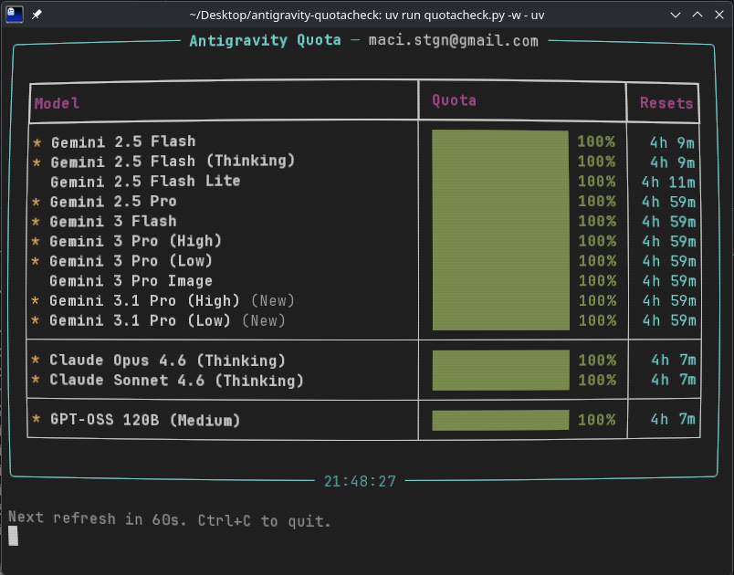

# antigravity-quotacheck

Terminal TUI for checking your [Google Antigravity](https://idx.google.com/) AI model quota — the same info you see in the Antigravity IDE quota dashboard, but from the command line.



## Features

- Live quota percentages for all models (Gemini, Claude, GPT-OSS)
- Color-coded progress bars — green (>50%), yellow (>20%), red (<20%)
- Reset countdown timers
- Models grouped by provider with recommended models starred
- Watch mode for continuous monitoring
- Raw JSON output for scripting

## Prerequisites

You need an `antigravity-accounts.json` file with a valid Google OAuth refresh token. This is created automatically by the [opencode-antigravity-auth](https://github.com/NoeFabris/opencode-antigravity-auth) plugin if you use OpenCode, or you can set one up manually.

The tool looks for credentials in order:

1. `~/.config/opencode/antigravity-accounts.json`
2. `$XDG_DATA_HOME/opencode/antigravity-accounts.json` (if set and differs from default)
3. `~/.local/share/opencode/antigravity-accounts.json`

## Install & Run

Requires [uv](https://docs.astral.sh/uv/).

```bash
git clone <repo-url> && cd antigravity-quotacheck
uv run python quotacheck.py
```

## Usage

```
usage: quotacheck.py [-h] [--watch] [--interval SECS] [--account INDEX] [--json]

options:
  -h, --help                show this help message and exit
  --watch, -w               Auto-refresh periodically
  --interval, -i SECS       Refresh interval in seconds (default: 60)
  --account, -a INDEX       Account index (default: 0)
  --json, -j                Output raw JSON instead of TUI
```

### Examples

```bash
# One-shot check
uv run python quotacheck.py

# Watch mode, refresh every 30 seconds
uv run python quotacheck.py -w -i 30

# Dump raw API response as JSON
uv run python quotacheck.py --json

# Use a different account (if you have multiple)
uv run python quotacheck.py -a 1
```

## Running Tests

```bash
uv run pytest
```

## How It Works

1. Reads the OAuth refresh token from your `antigravity-accounts.json`
2. Exchanges it for a short-lived access token via Google's OAuth2 token endpoint (cached for ~55 minutes)
3. Calls `POST cloudcode-pa.googleapis.com/v1internal:fetchAvailableModels` — the same internal API that the Antigravity IDE uses
4. Parses `remainingFraction` (0.0–1.0) and `resetTime` for each model and renders the TUI

Internal-only models (tab completion, chat internals) are filtered out automatically.

## Quota Reset Timers

Antigravity quotas operate on **rolling ~5-hour windows** for paid (AI Pro/Ultra) subscribers and **weekly windows** for free users. The reset timer starts from your first usage of a given model group — not from a fixed daily schedule.

Reset timers are **per-model-group**, not universal. Models that share a quota pool share a reset timer:

| Group | Models | Shared Timer |
|-------|--------|--------------|
| Gemini Pro | Gemini 3 Pro, 3.1 Pro, 2.5 Pro, 3 Pro Image, 3 Flash | Yes |
| Gemini Flash | Gemini 2.5 Flash, 2.5 Flash (Thinking) | Yes |
| Gemini Flash Lite | Gemini 2.5 Flash Lite | Own timer |
| Claude | Claude Sonnet 4.6, Claude Opus 4.6 | Yes |
| GPT | GPT-OSS 120B | Shared with Claude |

The API returns live data on every call with no server-side caching. Polling every 30–60 seconds is more than sufficient.

### Accuracy

The `remainingFraction` from this API matches what the Antigravity IDE dashboard shows. However, Google runs a **separate per-minute burst rate limiter** on top of the quota system. This means you can still get HTTP 429 errors even when `remainingFraction` shows quota available. The quota dashboard (and this tool) tracks the broader allocation, not the per-minute rate limit.
